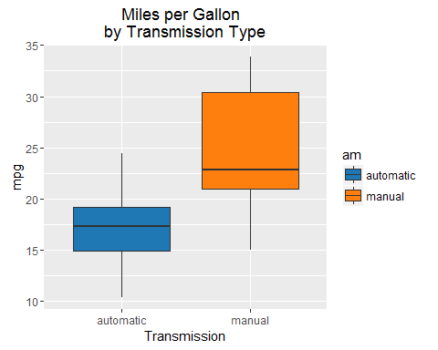
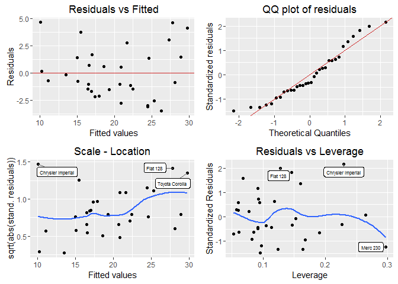

# Fuel Efficiency and Transmission Type
DanH  
October 2, 2016  

###Executive Summary

We want to explore the relationship between transmission type and fuel efficiency expressed in miles per gallon (MPG). More specifically we want to analyze the following:

* "Is an automatic or manual transmission better for MPG"
* "Quantify the MPG difference between automatic and manual transmissions"


```r
library(tidyverse)
library(GGally)
library(ggfortify)
library(ggthemes)
library(knitr)
library(broom)
```

###Data processing and exploratory analysis

The dataset is from the 1974 edition of _Motor Trend US Magazine_. It contains data on 1973/1974 car models. It consists of 32 observations of 11 variables. The variables `am`, `cyl`, `gear`, `vs` can be conveniently converted from numeric to factor type.


```r
# convert variables 'am', 'cyl', 'gear', 'vs' to factor
mtcars <- mtcars %>% mutate_each(funs(as.factor), am, cyl, gear, vs)

#assign proper levels
levels(mtcars$am) <- c("automatic", "manual")
levels(mtcars$vs) <- c("V", "S")

str(mtcars)
```

```
## 'data.frame':	32 obs. of  11 variables:
##  $ mpg : num  21 21 22.8 21.4 18.7 18.1 14.3 24.4 22.8 19.2 ...
##  $ cyl : Factor w/ 3 levels "4","6","8": 2 2 1 2 3 2 3 1 1 2 ...
##  $ disp: num  160 160 108 258 360 ...
##  $ hp  : num  110 110 93 110 175 105 245 62 95 123 ...
##  $ drat: num  3.9 3.9 3.85 3.08 3.15 2.76 3.21 3.69 3.92 3.92 ...
##  $ wt  : num  2.62 2.88 2.32 3.21 3.44 ...
##  $ qsec: num  16.5 17 18.6 19.4 17 ...
##  $ vs  : Factor w/ 2 levels "V","S": 1 1 2 2 1 2 1 2 2 2 ...
##  $ am  : Factor w/ 2 levels "automatic","manual": 2 2 2 1 1 1 1 1 1 1 ...
##  $ gear: Factor w/ 3 levels "3","4","5": 2 2 2 1 1 1 1 2 2 2 ...
##  $ carb: num  4 4 1 1 2 1 4 2 2 4 ...
```


```r
# Figure a
mtcars %>% ggplot(aes(am, mpg)) +
  geom_boxplot(aes(fill = am)) +
  scale_fill_tableau(palette = "tableau10") +
  ggtitle("Miles per Gallon  \nby Transmission Type") +
  xlab("Transmission") 
```

<!-- -->


It appears (Fig 1 in the appendix) that the transmission type _manual_ is more fuel efficient than the transmission type _automatic_. 

---

###Inference

We want to verify that the difference in mileage between the two types of transmission is statistically significant, so we run a t.test for the two levels _automatic_ and _manual_ in the `am` variable


```r
tt <- t.test(mpg ~ am, data = mtcars)

t.tab <- tidy(tt) %>% rename(mean_automatic = estimate1, mean_manual = estimate2) %>% select(-method, - alternative) %>% select(mean_automatic, mean_manual,  conf.low, conf.high, estimate, statistic, p.value)

kable(t.tab, caption = "t.test ouput")
```


Table: t.test ouput

 mean_automatic   mean_manual    conf.low   conf.high    estimate   statistic     p.value
---------------  ------------  ----------  ----------  ----------  ----------  ----------
       17.14737      24.39231   -11.28019   -3.209684   -7.244939   -3.767123   0.0013736

The t-test(Table 1 above) shows (with p-value = 0.001) that cars with manual transmission tend to have higher mileage. We will further investigate this using multiple regression.

---

###Fitting a multiple regression model

Now we want to fit a model that includes all potentially important variables simultaneously in order to evaluate the relationship between a predictor variable and the outcome while controlling for the potential influence of other variables. We first consider a model which includes all variables. For this full model(Table 6, appendix) we can see that even though the adjusted R squared is roughly 0.80, none of the predictors are statistically significant. We need a better selection of predictors and we determine it by performing stepwise regression. The R function _step()_ can be used for this selection. The resulting model (tables below) not only has a better adjusted R squared than the full model, but the predictors are all statistically significant (p-value < 0.05)


```r
# model selection
all_Fit <- lm(mpg ~ ., mtcars)
best_Fit <- step(all_Fit, trace=FALSE)
kable(tidy(best_Fit), caption = "regression output")
```


Table: regression output

term            estimate   std.error   statistic     p.value
------------  ----------  ----------  ----------  ----------
(Intercept)     9.617781   6.9595930    1.381946   0.1779152
wt             -3.916504   0.7112016   -5.506882   0.0000070
qsec            1.225886   0.2886696    4.246676   0.0002162
ammanual        2.935837   1.4109045    2.080819   0.0467155

```r
reg.tab <- glance(best_Fit)
reg.tab <- reg.tab %>% select(-(7:11))
kable(reg.tab)
```


 r.squared   adj.r.squared      sigma   statistic   p.value   df
----------  --------------  ---------  ----------  --------  ---
 0.8496636       0.8335561   2.458846    52.74964         0    4

The selected model `mpg ~ wt + qsec + am` is dependent on the transmission type _am_, but also weight _wt_(with negative coefficient, which makes sense) and acceleration _qsec_. All predictors have significant p-values and the adjusted R-squared is 0.83(roughly). Furthermore, after comparing our selected model to a univariate base model containing only `am` as predictor and obtaining a highly significant p-value, we conclude that the confounding variables `qsec` and `wt` do contribute to the accuracy of the model.(Table8, App.)

---

###Model diagnostics and conditions for regression


```r
library(gridExtra, warn.conflicts = F)
library(ggrepel)

data("mtcars")
myfortdata <- fortify(best_Fit)
myfortdata.2 <- myfortdata %>% mutate(.model = rownames(mtcars))

# diagnostic plots
gg1 <- ggplot(myfortdata, aes(x = .fitted, y = .resid)) +
       geom_hline(yintercept = 0, colour = "firebrick3") +
       geom_point() +
       ggtitle("Residuals vs Fitted") +
       xlab("Fitted values") +
       ylab("Residuals")

gg2 <- ggplot(myfortdata) +
        stat_qq(aes(sample = .stdresid)) +
        geom_abline(colour = "firebrick3") +
        ggtitle("QQ plot of residuals") +
        ylab("Standardized residuals") +
        xlab("Theoretical Quantiles")

stdrs <- myfortdata.2 %>% arrange(desc(.stdresid)) %>% head(3)
gg3 <- ggplot(myfortdata, aes(.fitted, sqrt(abs(.stdresid)))) +
       geom_point() +
       geom_smooth(se = FALSE) +
       geom_label_repel(aes(label = .model), data = stdrs, size = 2) +
       ggtitle("Scale - Location") +
       xlab("Fitted values")  +
       ylab("sqrt(abs(stand. residuals))")
 
cks_dat <- myfortdata.2 %>% arrange(desc(.cooksd)) %>% head(3)
gg4 <- ggplot(myfortdata.2,aes(.hat, .stdresid)) +
       geom_point() +
       geom_smooth(se = F) +
       geom_label_repel (aes(label = .model), data = cks_dat, size = 2) +
       ggtitle("Residuals vs Leverage") +
       xlab("Leverage") +
       ylab("Standardized Residuals")

grid.arrange(gg1, gg2, gg3, gg4, ncol = 2, nrow = 2, name = "Diagnostic Plots")
```

<!-- -->

Looking at the diagnostic plots above there doesn't appear to be any significant non-linear pattern, the residuals are randomly scattered around zero(_Residuals vs Fitted_). Looking at the _QQ plot of residuals_  we just see some deviations at the tail areas but the normality assumption for the residuals appears to be confirmed._Scale-Location_, shows randomly scattered residuals confirming homoscedasticity. Finally, the _Residuals vs Leverage_ plot, detects outliers(labelled points) but they don't appear to be particularly influential(Cook's distance well below 0.5). All in all, we can say that conditions for linear regression are met.

---

###Conclusions

Based on our analysis, we can say that, in terms of fuel efficiency, manual transmission is better than automatic. Taking into account confounding variables, manual transmission cars allow, on average, to drive 2.94 MPG more than automatic transmission cars do. Our selected model explains about 83% of the overall variation in MPG

---

###Appendix

---


* ####Table 4


Table: Single variable model output

term            estimate   std.error   statistic    p.value
------------  ----------  ----------  ----------  ---------
(Intercept)    17.147368    1.124602   15.247492   0.000000
am              7.244939    1.764422    4.106127   0.000285


 r.squared   adj.r.squared      sigma   statistic    p.value   df
----------  --------------  ---------  ----------  ---------  ---
 0.3597989       0.3384589   4.902029    16.86028   0.000285    2

---

* ####Table 6


Table: Full model output

term             estimate    std.error    statistic     p.value
------------  -----------  -----------  -----------  ----------
(Intercept)    12.3033742   18.7178844    0.6573058   0.5181244
cyl            -0.1114405    1.0450234   -0.1066392   0.9160874
disp            0.0133352    0.0178575    0.7467585   0.4634887
hp             -0.0214821    0.0217686   -0.9868407   0.3349553
drat            0.7871110    1.6353731    0.4813036   0.6352779
wt             -3.7153039    1.8944143   -1.9611887   0.0632522
qsec            0.8210407    0.7308448    1.1234133   0.2739413
vs              0.3177628    2.1045086    0.1509915   0.8814235
am              2.5202269    2.0566506    1.2254035   0.2339897
gear            0.6554130    1.4932600    0.4389142   0.6652064
carb           -0.1994193    0.8287525   -0.2406258   0.8121787


 r.squared   adj.r.squared      sigma   statistic   p.value   df
----------  --------------  ---------  ----------  --------  ---
 0.8690158       0.8066423   2.650197    13.93246     4e-07   11

---

* ####Table 8


Table: Analysis of Variance Table

 res.df        rss   df      sumsq   statistic   p.value
-------  ---------  ---  ---------  ----------  --------
     30   720.8966   NA         NA          NA        NA
     28   169.2859    2   551.6107    45.61838         0

